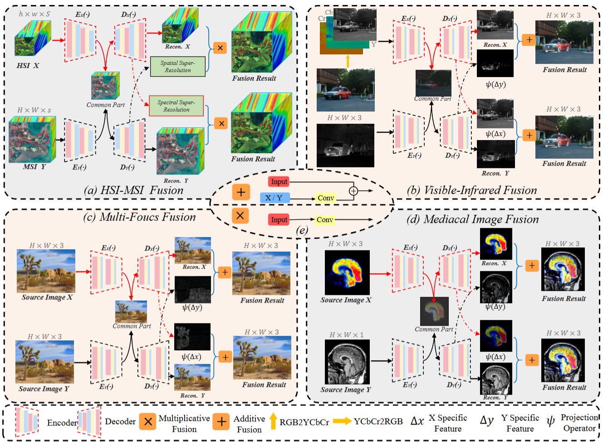
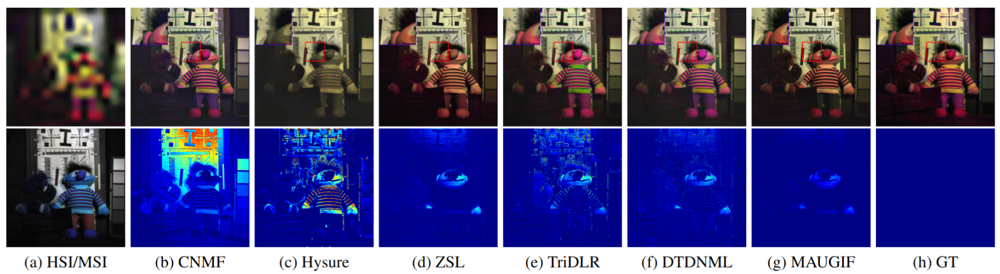
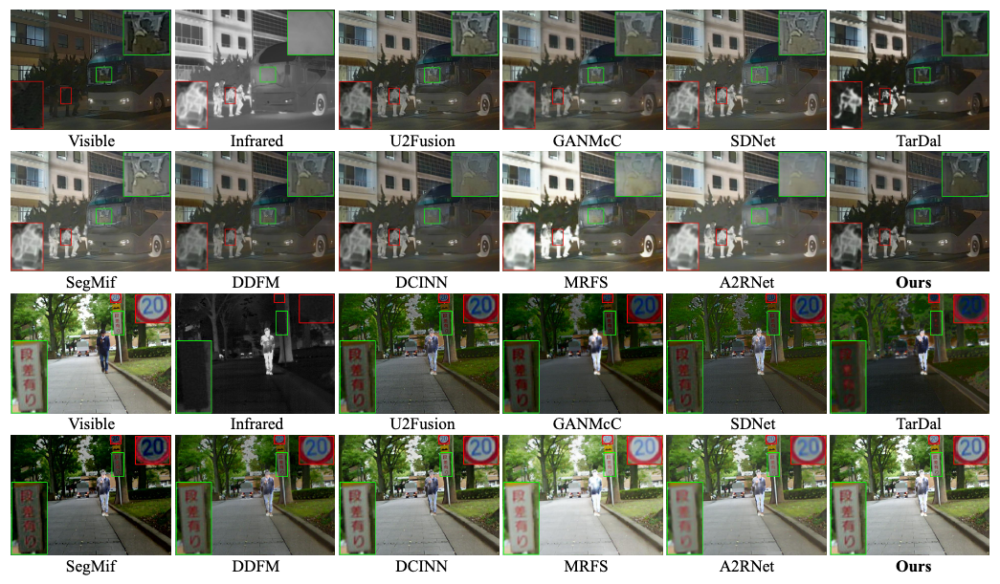
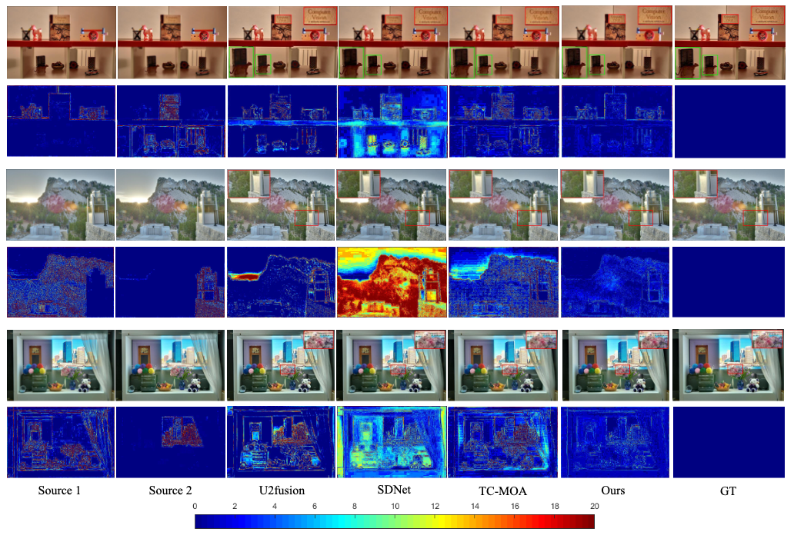
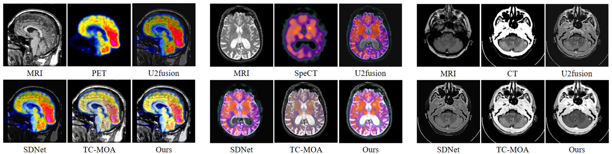

# MAUGIF
This is official Pytorch implementation of "[MAUGIF: Mechanism-Aware Unsupervised General Image Fusion via Dual Cross-Image Autoencoders](https://arxiv.org/abs/2511.08272)"
 - 
```
@article{

}
```
## Framework


## Recommended Environment
 - [ ] torch  1.13.1
 - [ ] cudatoolkit 11.8
 - [ ] torchvision 0.14.0
## The architecture of the project is shown as follows:
```
MAUGIF/
├── HSI-MSI
│   ├── demo_hsms.py
│   └── network.py
├── images
│   ├── HMF.png
│   ├── Medical.png
│   ├── MFF.png
│   ├── ModelArch.png
│   └── VIF.png
├── IR-VIS
│   ├── checkpoints
│   ├── model
│   ├── out
│   ├── test_demo.py
│   ├── test.py
│   └── train.py
├── MedicalImage
│   ├── checkpoints
│   ├── model
│   ├── out
│   ├── test_demo.py
│   ├── test.py
│   └── train.py
├── MultiFocus
│   ├── checkpoints
│   ├── model
│   ├── out
│   ├── test_demo.py
│   ├── test.py
│   └── train.py
└── README.md
```


## Experiments 
### Dataset & Checkpoints & Results
The results can be in [MAUGIF](https://www.dropbox.com/scl/fo/cmzser4ibtza4afqqw9yh/ABNRa83qn3rh1P_5UwTpWno?rlkey=u3ytba9dmblnv1w0y8lnbgk3h&st=x526zldf&dl=0). 
If you need to evaluate other datasets, please organize them as follows:
```
├── /dataset
|
|───VIF/
|   ├── test
|   │   ├── ir
|   │   └── vi
|   └── train
|        ├── ir
|        └── vi
|───MFF/
|   ├── test
|   │   ├── FAR
|   │   └── NEAR
|   └── train
|        ├── FAR
|        └── NEAR
└───MEF/
    ├── CT_MRI
    │   ├── MRI
    │   └── CT
    |── PET_MRI
    |    ├── MRI
    |    └── PET
    └── SPECT_MRI
         ├── MRI
         └── SPECT

    ......
```
### Evaluate model
python
```
python test_model.py
```
### run sample
python
```
python test_demo.py
```
### To Train
Before training MAUGIF, you need to download the MSRS dataset MSRS and putting it in ./datasets.

Then running 
python
```
python train_model.py
```
### Fusion comparison




## If this work is helpful to you, please cite it as：
```
@article{
}
```
## Acknowledgements